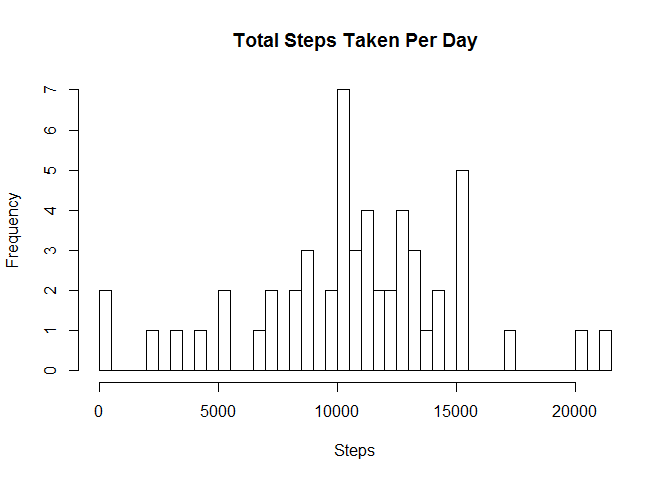
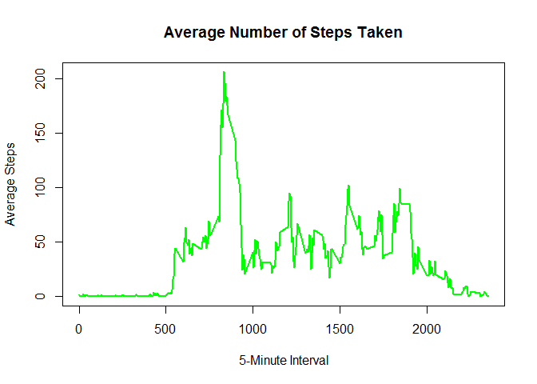
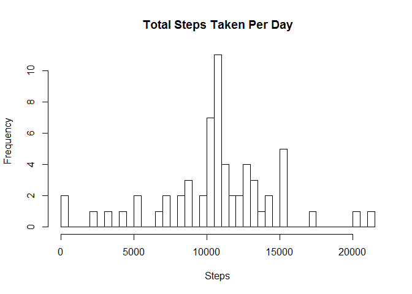

### Read in the Data

    act <- read.csv("activity.csv", na.strings = "NA", stringsAsFactors = FALSE, colClasses = c("numeric","Date","numeric"))

What is mean total number of steps taken per day?
-------------------------------------------------

1.  Prepare data for analysis

<!-- -->

    act1 <- na.omit(act)
    act1_byday <- aggregate(act1$steps, by=list(day=act1$date), FUN=sum)

1.  Plot the histogram

<!-- -->

    hist(act1_byday$x, breaks=59, main="Total Steps Taken Per Day", xlab = "Steps")

1.  Calculate the mean

<!-- -->

    mean(act1_byday$x)

    ## [1] 10766.19

1.  Calucluate the median

<!-- -->

    median(act1_byday$x)

    ## [1] 10765

What is the average daily activity pattern?
-------------------------------------------

1.  Prepare data for analysis and plot

<!-- -->

    act2 <- aggregate(steps ~ interval, data = act, mean, na.rm = TRUE)
    plot(act2$interval, act2$steps, type = "l", lwd = 2, col = "green", main = "Average Number of Steps Taken", xlab = "5-Minute Interval", ylab = "Average Steps")

1.  Calculate 5-minute interval with maximum number of steps

<!-- -->

    act2$interval[which.max(act2$steps)]

    ## [1] 835

Imputing missing values
-----------------------

1.  Calculate number of missing NAs

<!-- -->

    table(complete.cases(act))

    ## 
    ## FALSE  TRUE 
    ##  2304 15264

As we are calculating NAs across any row in any column, we use the
"FALSE" count as the total, therefore the answer is 2,304.

1.  Create a way to fill in the missing values. Do this by looping
    through the full "activity" dataset and filling in the missing
    values with the average values of each internal (from
    question above)

<!-- -->

    act3 <- act 
    for (i in act2$interval) {
            act3[act3$interval == i & is.na(act3$steps), ]$steps <- act2$steps[act2$interval == i]
    }
    table(complete.cases(act3))

    ## 
    ##  TRUE 
    ## 17568

Using the table command again, we see that there are not FALSE values,
hence no "incomplete"" cases

1.  Plot and calculate mean and median as similar to question \#1 above

<!-- -->

    act3_byday <- aggregate(act3$steps, by=list(day=act3$date), FUN=sum)

    hist(act3_byday$x, breaks=59, main="Total Steps Taken Per Day", xlab = "Steps")

    mean(act3_byday$x)

    ## [1] 10766.19

    median(act3_byday$x)

    ## [1] 10766.19

There really isn't much impact to the resulting data from imputing the
values. This isn't really surprising considering that the imputed values
were averages of existing data. Overall, there is very little impact
from the imputed data.

Are there differences in activity patterns between weekdays and weekends?
-------------------------------------------------------------------------

1.  Create dataset with "weekdays" factor

<!-- -->

    act4 <- act3
    act4$weekday <- weekdays(act4$date, abbreviate = FALSE)

    act4$weekpart <- ""

    act4[act4$weekday == "Saturday" | act4$weekday == "Sunday", ]$weekpart <- "Weekend"
    act4[!(act4$weekday == "Saturday" | act4$weekday == "Sunday"), ]$weekpart <- "Weekday"

1.  Plot the average 5-minute interval for each "weekday" or "weekend"

<!-- -->

    library(lattice)

    act4_byday <- aggregate(steps ~ interval + weekpart, data = act4, mean)

    xyplot(steps ~ interval | weekpart, data = act4_byday, layout = c(1, 2), type="l")

